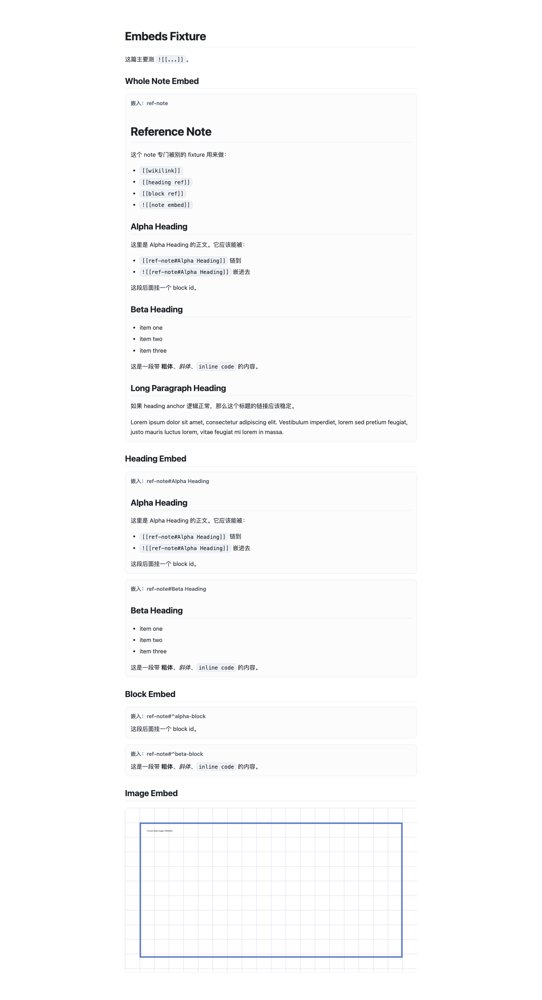
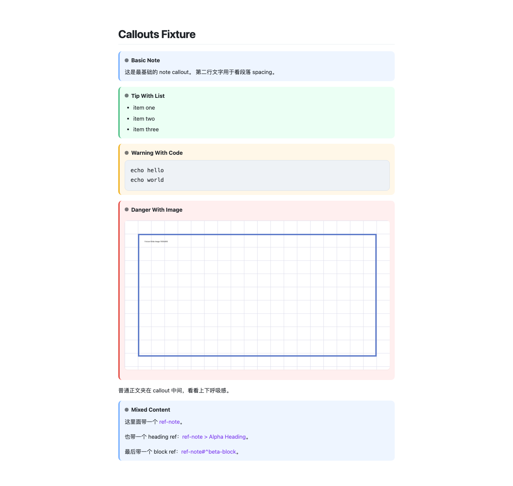
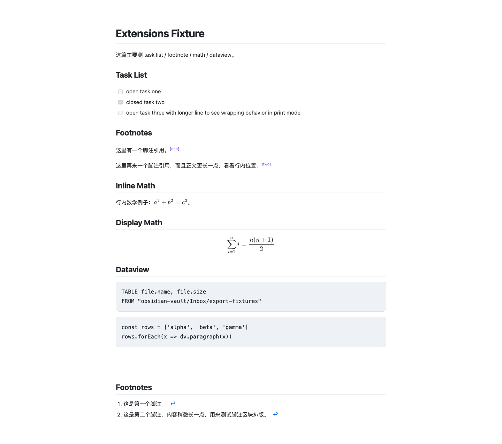

<div align="center">
  
  # VaultPress

  
  
  
  
  

  **Export Obsidian-style Markdown notes to high-quality PDFs**
</div>

VaultPress is an **Obsidian-aware Markdown to PDF exporter** for note-heavy documents, research notes, embeds, callouts, equations, and mixed Chinese/English technical writing.

It is built for people whose Markdown actually looks like Obsidian notes.
It is **not** trying to be the most generic Markdown-to-PDF CLI.

## At a glance

VaultPress is for:
- Obsidian-style notes with `[[wikilink]]`, embeds, callouts, footnotes, math, and mixed technical writing
- people who care more about note export quality than generic Markdown feature breadth
- browser-quality PDF export with practical debugging hooks

VaultPress is not for:
- full Obsidian theme/plugin fidelity
- arbitrary browser automation workflows
- being the broadest general-purpose Markdown PDF product

Compared with a generic Markdown-to-PDF tool, VaultPress is already strong at:
- Obsidian-specific syntax
- note embeds and callouts
- page breaks and PDF headers/footers
- Chinese technical notes and research-style layouts
- browser-print output tuned around real reading notes

## Table of contents

- [Installation](#installation)
- [Quick start](#quick-start)
- [First Run Check](#first-run-check)
- [Examples](#examples)
- [CLI options](#cli-options)
- [CLI examples](#cli-examples)
- [Path resolution](#path-resolution)
- [Frontmatter config](#frontmatter-config)
- [Development](#development)
- [Page Breaks](#page-breaks)
- [Headers And Footers](#headers-and-footers)
- [Screenshots](#screenshots)
- [Troubleshooting](#troubleshooting)
- [Why VaultPress exists](#why-vaultpress-exists)
- [Positioning](#positioning)
- [Current pipeline](#current-pipeline)
- [Supported features](#supported-features)
- [What VaultPress is already good at](#what-vaultpress-is-already-good-at)
- [Repository layout](#repository-layout)
- [Known limitations](#known-limitations)
- [What still needs work](#what-still-needs-work)
- [Roadmap (near-term)](#roadmap-near-term)
- [License](#license)

## Installation

Install dependencies:

```bash
npm install
```

VaultPress currently expects:
- Node.js 18+
- a locally installed Chromium-family browser

Auto-detection currently checks:
- explicit `--browser` path first
- browser executables on `PATH`
- common install locations for Google Chrome, Chromium, and Microsoft Edge

For local CLI usage during development, you can link the package:

```bash
npm link
```

For packaging, VaultPress now ships only runtime files:
- `bin/vaultpress`
- `lib/`
- `README.md`
- `LICENSE`

Fixtures, tests, and internal docs stay repository-only.

After that, the intended CLI usage is:

```bash
vaultpress --output out.pdf path/to/note.md
# or
vp --output out.pdf path/to/note.md
```

## Quick start

Export one note from the repository root:

```bash
npm run export -- --output out.pdf path/to/note.md
```

Or call the repository entrypoint directly:

```bash
bin/vaultpress --output out.pdf path/to/note.md
```

## First Run Check

After `npm install`, this is the fastest way to verify the whole toolchain:

1. Check the CLI surface:

```bash
bin/vaultpress --help
```

2. Run the automated suite:

```bash
npm test
```

3. Run one real export:

```bash
bin/vaultpress --output /tmp/vaultpress-smoke.pdf fixtures/01-basic-layout.md
ls -lh /tmp/vaultpress-smoke.pdf
```

4. If you want to inspect the rendered HTML too:

```bash
bin/vaultpress --debug-html /tmp/vaultpress-smoke.html \
  --output /tmp/vaultpress-smoke.pdf \
  fixtures/06-extensions.md
```

5. If you are checking publish contents locally:

```bash
npm run pack:check
```

6. If you want to regenerate the showcase screenshots:

```bash
npm run screenshots
```

## Examples

Recommended showcase set for this project:
- `fixtures/03-embeds.pdf`
- `fixtures/04-callouts.pdf`
- `fixtures/06-extensions.pdf`

Current screenshot showcase:





Those cover:
- Obsidian-aware syntax
- embed handling
- callouts
- math rendering
- realistic technical-note export quality

See also:
- `examples/EXAMPLES.md`
- `examples/COMPARISON-NOTES.md`

## CLI options

Current options:
- `--output <file.pdf>`
- `--debug-html <file>`
- `--keep-temp`
- `--browser <path>`
- `--paper-size <size>`
- `--help`

## CLI examples

Export a note to a specific output path:

```bash
vaultpress --output out.pdf notes/overview.md
```

Export while keeping temporary render files for debugging:

```bash
vaultpress --keep-temp --output out.pdf notes/overview.md
```

When an export fails, VaultPress now keeps the temp directory automatically even without `--keep-temp`, so the browser log and rendered HTML remain available for inspection.

Save the intermediate HTML for inspection:

```bash
vaultpress --debug-html debug/rendered.html --output out.pdf notes/overview.md
```

Use a different paper size:

```bash
vaultpress --paper-size Letter --output out.pdf notes/overview.md
```

Use a custom browser binary instead of auto-detection:

```bash
vaultpress --browser "/Applications/Microsoft Edge.app/Contents/MacOS/Microsoft Edge" \
  --output out.pdf \
  notes/overview.md
```

## Path resolution

VaultPress now resolves CLI paths relative to the directory where you run the command, not the repository root.

That applies to:
- the input note path
- `--output`
- `--debug-html`
- `--browser`

Example:

```bash
cd ~/Documents/my-vault
vaultpress --output exports/weekly.pdf notes/weekly.md
```

In that case:
- `notes/weekly.md` resolves inside `~/Documents/my-vault`
- `exports/weekly.pdf` is written inside `~/Documents/my-vault/exports`

## Frontmatter config

VaultPress supports note-level frontmatter via `gray-matter`.

```yaml
---
title: Exported PDF title
paper-size: Letter
margin: 16mm 14mm 18mm 14mm
print-background: true
extra-css: path/to/custom.css
---
```

It also accepts the same values inside a nested `pdf` or `pdf_options` object:

```yaml
---
title: Exported PDF title
pdf:
  format: Letter
  margin: 16mm 14mm 18mm 14mm
  print_background: true
---
```

Currently supported fields:
- `title`
- `paper-size`
- `margin`
- `print-background`
- `extra-css`

Accepted aliases currently include:
- `paper-size`, `paper_size`, `paperSize`, `format`
- `print-background`, `print_background`
- `document-title`, `document_title`
- `extra-css`, `extra_css`

Notes:
- `format` maps to the print paper size
- `extra-css` is resolved relative to the current note first, then the CLI working directory
- frontmatter is intentionally still lightweight; this is not a full generic config system yet

## Development

Run the regression suite:

```bash
npm test
```

Current automated coverage focuses on:
- render pipeline regression checks
- frontmatter parsing
- CLI path resolution
- browser path resolution
- temp/log lifecycle behavior
- package manifest/runtime packaging rules

Useful development commands:

```bash
npm test
npm run screenshots
npm run pack:check
```

## Page Breaks

VaultPress supports explicit PDF page breaks.

Supported forms:

```markdown
\pagebreak
```

```markdown
---page-break---
```

```html
<div class="page-break"></div>
```

All three forms render as a forced page break in the generated PDF.

## Headers And Footers

VaultPress now supports browser-level PDF headers and footers via frontmatter.

Example:

```yaml
---
pdf:
  margin: 20mm 14mm 20mm 14mm
  headerTemplate: |
    <div style="width:100%; font-size:10px; padding:0 10mm; color:#666;">
      <span class="title"></span>
    </div>
  footerTemplate: |
    <div style="width:100%; font-size:10px; padding:0 10mm; color:#666; text-align:right;">
      Page <span class="pageNumber"></span> / <span class="totalPages"></span>
    </div>
---
```

Notes:
- `headerTemplate` and `footerTemplate` are passed to the browser PDF engine
- if either template is present, header/footer display is enabled automatically
- you usually want a larger top/bottom `margin` when using them
- browser-supported placeholders such as `pageNumber`, `totalPages`, `title`, and `date` can be used inside the template HTML

## Screenshots

VaultPress now includes a repeatable screenshot workflow for showcase examples.

Generate the default showcase set:

```bash
npm run screenshots
```

Generate specific fixtures:

```bash
bin/vaultpress-screenshots 03-embeds 04-callouts
```

Screenshots are written to:

```text
examples/screenshots/
```

## Troubleshooting

If export fails, check these first:

- Run `bin/vaultpress --help` to confirm the CLI is linked and callable.
- Run `npm test` to make sure the local install is healthy.
- If browser launch fails, pass an explicit binary:

```bash
bin/vaultpress --browser "/Applications/Microsoft Edge.app/Contents/MacOS/Microsoft Edge" \
  --output out.pdf \
  fixtures/01-basic-layout.md
```

- On failure, VaultPress now prints the exact paths for:
  - the kept temp directory
  - the browser log
  - the rendered HTML

- If you want the rendered HTML regardless of success or failure, use:

```bash
bin/vaultpress --debug-html /tmp/vaultpress-debug.html --output out.pdf note.md
```

- If you want temp files preserved even on success, use:

```bash
bin/vaultpress --keep-temp --output out.pdf note.md
```

## Why VaultPress exists

Generic Markdown-to-PDF tools are fine for standard Markdown.

But real Obsidian notes often contain things like:
- `[[wikilink]]`
- `[[note#heading]]`
- `[[note#^block]]`
- `![[note]]`
- `![[note#heading]]`
- `![[note#^block]]`
- callouts
- task lists
- footnotes
- math
- Dataview / DataviewJS code blocks

VaultPress adds an **Obsidian-aware preprocessing layer** before browser printing, so the final PDF is closer to how note-heavy documents are actually written and read.

## Positioning

VaultPress should be thought of as:
- an **Obsidian-aware Markdown to PDF exporter**
- a tool for **high-quality PDF export of Obsidian-style notes**
- a browser-print-based pipeline tuned for **real note content**, not just generic Markdown samples

It should **not** be framed as:
- “another md-to-pdf clone”
- “the most generic Markdown PDF CLI”

## Current pipeline

1. Markdown / Obsidian note
2. Obsidian-aware preprocessing → HTML
3. Chromium-family browser print pipeline
4. PDF output

This gives the project a practical balance of:
- browser-quality rendering
- strong Chinese mixed-text output
- good handling for research-note style documents

## Supported features

### Standard Markdown
- headings
- paragraphs
- lists
- tables
- code blocks
- images

### Obsidian-aware features
- wikilinks
- heading refs
- block refs
- note embeds
- heading embeds
- block embeds
- callouts

### Other useful features
- task lists
- footnotes
- page breaks
- configurable PDF headers and footers
- MathJax-based math rendering
- Dataview / DataviewJS code-block display (non-executing)
- lightweight frontmatter-based export config

## What VaultPress is already good at

Compared with a generic Markdown-to-PDF tool, VaultPress is already strong at:
- Obsidian-specific syntax
- Obsidian-style embeds
- callout rendering
- math in note-heavy documents
- Chinese technical notes and research-style content
- browser-print output tuned around real reading notes

## Repository layout

- `bin/` — CLI entrypoints
- `lib/` — implementation scripts and render pipeline modules
- `test/` — regression tests
- `docs/obsidian-export-pdf/` — internal design notes and readiness checklist
- `examples/` — example notes and comparison notes
- `examples/screenshots/` — generated showcase screenshots
- `fixtures/` — local regression samples and exported outputs

## Known limitations

Current limitations worth being explicit about:
- not a full Obsidian renderer
- Dataview / DataviewJS blocks are displayed, not executed
- plugin compatibility is intentionally limited
- custom themes and full Obsidian styling are not reproduced 1:1
- current PDF backend depends on a locally installed Chromium-family browser
- browser auto-detection is pragmatic, not exhaustive

## What still needs work

Before a clean public release, the biggest gaps are still:
- broader browser/platform support

## Roadmap (near-term)

Near-term priorities:
1. broader browser/platform support

## License

MIT
